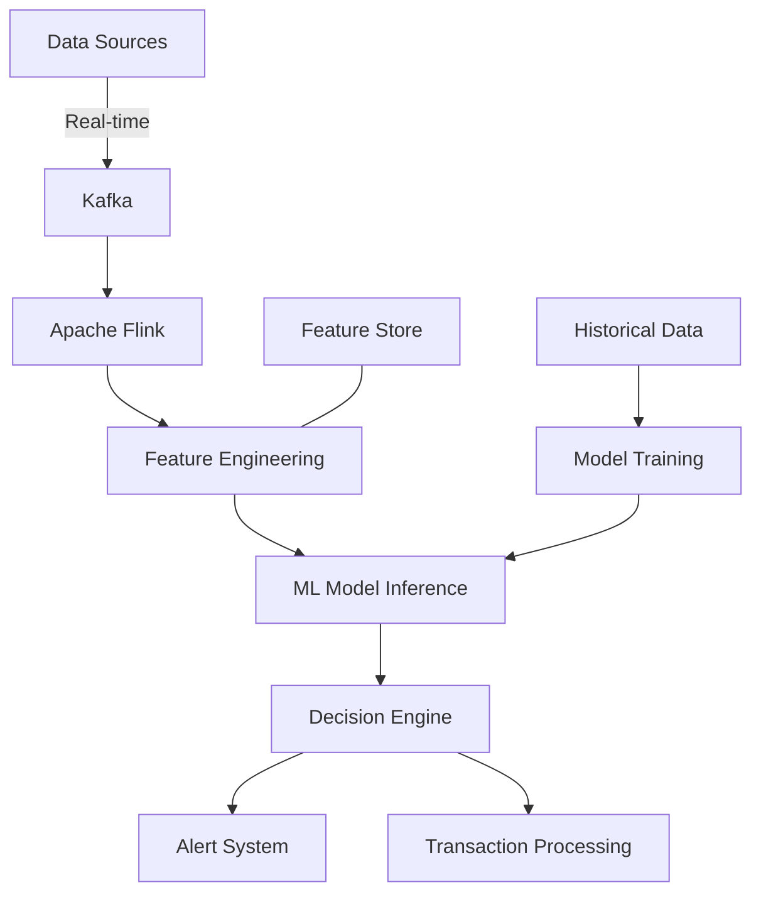
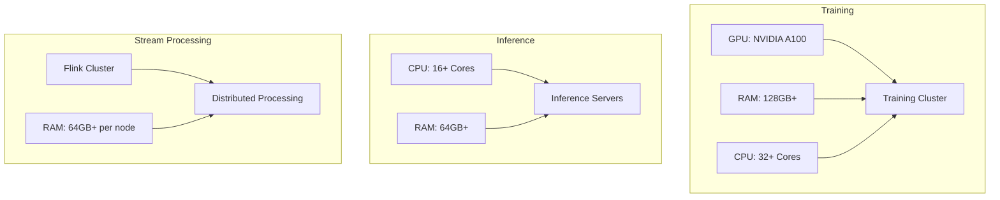
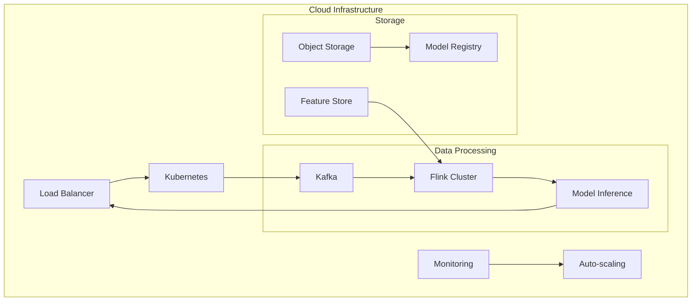
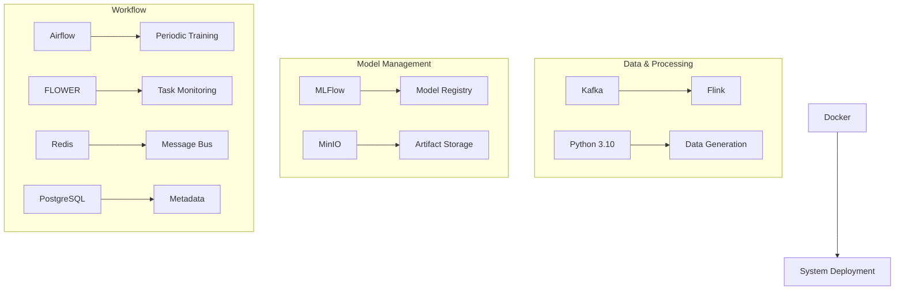
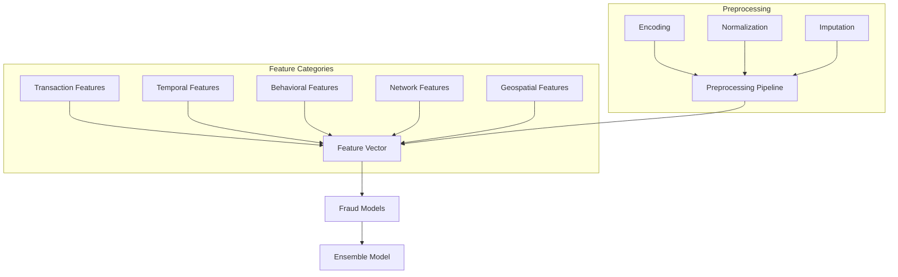

# Go-With-Me Fraud Detection

## Overview
This project demonstrates how to build a realtime fraud detection AI system from scratch. The end-to-end machine learning solution (a computer system that can learn from data) leverages Apache Flink (a tool for processing data streams quickly) for stream processing and implements advanced ML techniques to identify fraudulent activities in real-time. The system can process millions of transactions per second with sub-second latency (very fast response time), enabling immediate detection of suspicious activities.

## System Architecture
The system follows a streaming architecture (a design that handles continuous data flows) designed for low-latency, high-throughput fraud detection:

- **Data Ingestion**: Captures transaction data in real-time from multiple sources including payment gateways (services that process payments), banking systems, and user interactions
- **Stream Processing**: Apache Flink (replacing Spark in the original design) for advanced event time processing and stateful computations (keeping track of information over time)
- **Feature Engineering**: Real-time feature extraction and transformation (converting raw data into useful information for AI models) with both historical context and immediate transaction data
- **Model Prediction**: ML models (mathematical algorithms that make predictions) deployed for inference (using the trained model to make predictions) with optimized performance for low-latency decisions
- **Alerting System**: Immediate notification of potentially fraudulent transactions with configurable risk thresholds (customizable levels of risk sensitivity)



## Hardware Requirements
The training pipeline (system for teaching the AI model) requires specific hardware configurations to efficiently train models on large datasets. Our system has been optimized for the following specifications:

### Training Infrastructure
- **GPU Compute**: NVIDIA A100 or equivalent GPUs (specialized computer chips that process calculations in parallel) with at least 40GB VRAM (video memory)
- **CPU**: 32+ cores (processing units) with high clock speed for data preprocessing (cleaning and preparing data)
- **Memory**: 128GB+ RAM (computer memory) to handle large datasets in memory
- **Storage**: NVMe SSDs (very fast storage drives) with at least 2TB capacity and 3GB/s read/write speeds
- **Networking**: 25Gbps+ interconnect (fast network connection) for distributed training (splitting work across multiple machines)

### Inference Infrastructure
- **CPU**: Optimized for inference with 16+ cores
- **Memory**: 64GB+ RAM for model loading and real-time feature computation
- **Storage**: SSD with at least 500GB for model artifacts (files related to the trained model) and feature data
- **Networking**: 10Gbps+ for handling high request volumes

### Stream Processing Infrastructure
- **CPU**: 16+ cores per node in a distributed cluster (a group of connected computers working together)
- **Memory**: 64GB+ RAM per node for state management (keeping track of data over time)
- **Storage**: SSD with at least 1TB for checkpointing (saving progress) and recovery
- **Redundancy**: N+2 redundancy (extra backup systems) for high availability (ensuring the system stays running)



## Cloud Deployment
For production environments (real-world use), this system can be deployed on cloud infrastructure (computing resources provided over the internet) with the following recommendations. Our architecture is cloud-native (designed specifically for cloud environments) and can be implemented on AWS, GCP, or Azure (popular cloud service providers) with minimal adjustments.

### Key Components
- **Streaming Layer**: Managed Kafka services (pre-set up Kafka systems provided by cloud providers) (AWS MSK, Confluent Cloud, etc.)
- **Processing Layer**: Kubernetes-orchestrated (a system for automating deployment and scaling) Flink clusters with auto-scaling (automatically adjusting resources based on demand)
- **Storage Layer**: Combination of object storage (for storing files), time-series databases (for storing time-based data), and distributed databases (spread across multiple machines)
- **Monitoring**: Comprehensive observability stack (tools for monitoring system health) with distributed tracing (tracking requests through the system)
- **Deployment**: GitOps workflow (automated deployment from code repositories) with CI/CD pipelines (continuous integration/continuous delivery - automating testing and deployment)



## Tools & Technologies
The project utilizes the following technologies, carefully selected for their performance, scalability (ability to grow), and community support:

### Core Technologies
- **Docker**: Containerization (packaging applications and dependencies together) and orchestration for all system components
- **Python 3.10**: Programming language used for synthetic data production (creating artificial data) and ML model development
- **Apache Kafka**: High throughput and high availability message broker (system for passing messages between components)
- **Apache Flink**: Stream processing framework (system for handling continuous data flows) replacing Apache Spark for real-time inference
- **MLFlow**: Model registry (catalog of models) and artifacts handling (managing model files)
- **MinIO**: Object storage (file storage system) for model artifacts
- **Apache Airflow**: Workflow management (scheduling and monitoring tasks) for periodic model training
- **PostgreSQL**: Database for MLFlow and Airflow data storage
- **FLOWER**: Airflow worker and task scheduling visualization (visual monitoring of tasks)
- **Redis**: Celery message bus (system for distributing tasks) for task distribution



### Additional Technologies
- **Debezium**: Change Data Capture (CDC) (capturing changes in databases) for database integration
- **Apache Beam**: Unified programming model for batch (processing data in large groups) and streaming (continuous data flow)
- **Scikit-learn**: Machine learning library (collection of tools) for classical algorithms (traditional ML techniques)
- **PyTorch**: Deep learning framework (tools for building advanced neural networks) for model training
- **XGBoost**: Gradient boosting framework (powerful ML algorithm that builds models sequentially) for machine learning
- **ONNX Runtime**: Cross-platform inference accelerator (makes models run faster on different systems)
- **Feast**: Feature store (central repository for ML features) for ML features
- **Weights & Biases**: Experiment tracking and visualization (monitoring training progress)
- **Kubernetes**: Container orchestration (managing containerized applications)
- **Prometheus & Grafana**: Monitoring and visualization (tracking system performance)
- **Jaeger**: Distributed tracing (following requests through the system)
- **ArgoCD**: GitOps continuous delivery (automated deployment from code repositories)
- **Terraform**: Infrastructure as code (defining infrastructure in code files)

## ML Feature Modeling
The fraud detection model relies on carefully engineered features (attributes used by ML models) that capture various aspects of transactions and user behavior. Our approach combines real-time signals with historical patterns to achieve high accuracy with minimal false positives (incorrectly flagging legitimate transactions as fraudulent).

### Feature Categories
- **Transaction Features**: Core attributes of each transaction (amount, timestamp, etc.)
- **Temporal Features**: Time-based patterns and anomalies (unusual timing of transactions)
- **Behavioral Features**: User-specific patterns and deviations (changes from normal behavior)
- **Network Features**: Relationships between entities in the transaction graph (connections between users, merchants, etc.)
- **Device Features**: Characteristics of the devices used for transactions (browser type, operating system, etc.)
- **Geospatial Features**: Location-based risk signals (unusual locations, impossible travel scenarios)

### Preprocessing & Engineering
- **Standardization**: Normalize numerical features (scaling values to a standard range)
- **Encoding**: One-hot encoding for categorical variables (converting categories to binary vectors)
- **Imputation**: Handling missing values with appropriate strategies (filling in gaps in data)
- **Feature Crossing**: Creating interaction features (combining features to capture relationships)
- **Dimensionality Reduction**: When appropriate for specific models (reducing the number of features)

### Machine Learning Model Features
- **Real-time data consumption from Kafka**: Direct streaming data integration (getting data immediately as it's generated)
- **Temporal and behavioral feature engineering**: Creating time-based and behavioral patterns (making features that capture timing and behavior)
- **Class imbalance handling with SMOTE**: Synthetic Minority Over-sampling Technique (creating synthetic examples of the minority class - fraudulent transactions) for balanced training
- **Hyperparameter tuning with RandomizedSearchCV**: Automated ML parameter optimization (finding the best settings for the model)
- **XGBoost classifier with optimized threshold**: Gradient boosting with custom decision thresholds (adjusting the sensitivity of fraud detection)
- **MLflow experiment tracking and model registry**: Version control and experiment management (keeping track of different model versions)
- **Minio (S3) integration for model storage**: Scalable artifact storage (storing model files in a way that can grow)
- **Comprehensive metrics and visualization logging**: Performance monitoring and analysis (tracking how well the model is doing)



## Getting Started
1. Clone this repository (download the code to your computer)
   ```bash
   git clone https://github.com/your-org/go-with-me-fraud-detection.git
   cd go-with-me-fraud-detection
   ```

2. Set up the required dependencies (install necessary software)
   ```bash
   docker-compose up -d # Starts Kafka, Flink, and supporting services
   pip install -r requirements.txt # Install Python dependencies
   ```

3. Configure data sources (set up where the data comes from)
   ```bash
   cp config/example.env config/.env
   # Edit config/.env with your specific configuration
   ```

4. Deploy the Flink processing jobs (start the data processing)
   ```bash
   ./scripts/deploy-flink-jobs.sh
   ```

5. Train and deploy the ML models (teach the AI and put it to work)
   ```bash
   python train_models.py
   python deploy_models.py
   ```
